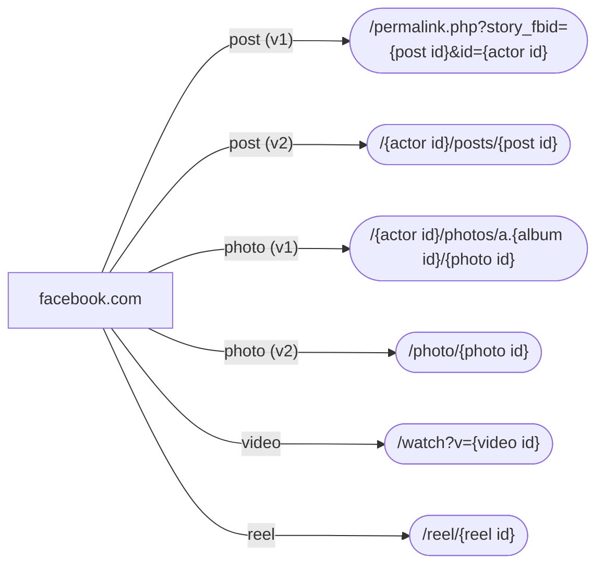

# Facebook IDs and their extraction

## Facebook IDs

Facebook IDs (also called FBIDs) are identifiers assigned by Facebook to each entity found on the platform, such as: user, page, story, photo gallery, video, etc. They are long integers, e.g. `100028295814975`.

Interestingly, Facebook IDs are unique in the scope of _whole Facebook_ and not per content type (as it's typically the case).

This allows Facebook to do a very cool thing: any content on the platform can be viewed by visiting the URL `https://facebook.com/{fbid}` where `{fbid}` is the FBID of the content. Since the IDs are stable, https://facebook.com/{fbid} is effectively a permalink.

## ID extraction

Broad categories of content found on Facebook, along with their URL templates, are at the time of writing:

* post (also referred to as story)
  * v1: `/permalink.php?story_fbid={post id}&id={actor id}`
  * v2: `/{actor id}/posts/{post id}`
* photo
  * v1: `/{actor id}/photos/a.{album id}/{photo id}`
  * v2: `/photo/{photo id}`
* video
  * `/watch?v={video id}`
* reel
  * `/reel/{reel id}`

Actor is either a user or a page.

The following diagram shows the URL template structure for these content types:

## Pseudonymized Facebook IDs (PFBIDs)

To prevent scraping of content by malicious bots, Facebook [decided to roll out](https://about.fb.com/news/2022/09/deterring-scraping-by-protecting-facebook-identifiers/) Pseudonymized Facebook IDs (also called PFBIDs).

They are long, seemingly random, alphanumeric strings having `pfbid` prefix, e.g. `pfbid0qKCasyrZYm8Yj75NCCmYRiX2WTVpmZQfMDFnyMpbrVLi93GbjWsj3BwK56owf3XKl`. They seem to be stable, i.e. they don't seem to change over time (at least for now).

For content links on Facebook, PFBIDs are gradually replacing canonical, integer FBIDs. Actor IDs still appear as integer FBIDs.

Similarly to FBIDs, the shorthand URL `https://facebook.com/{pfbid}` seems to also work for PFBIDs.
